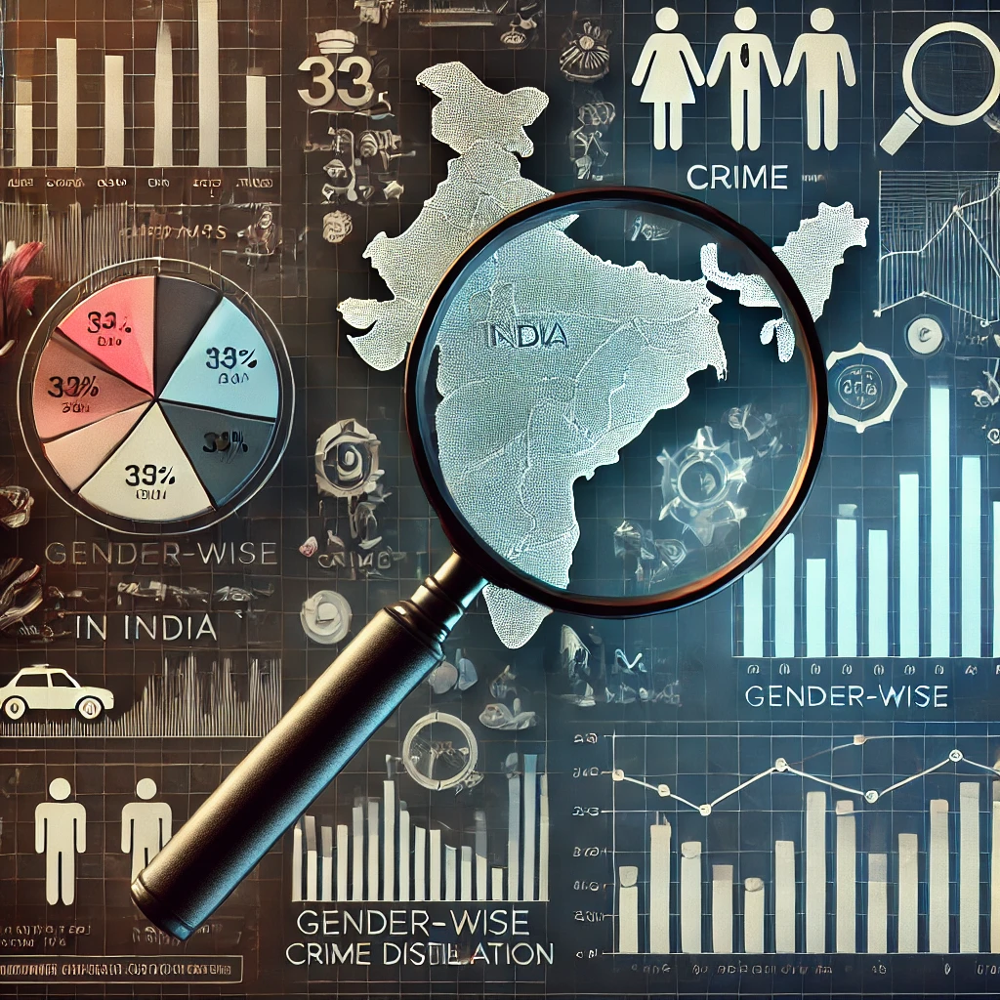

# 🔍 Crime Data Analysis in India

## 📌 Introduction
This project aims to analyze crime trends in India using a dataset containing crime records across various cities. The analysis includes identifying the most crime-affected cities, understanding gender-based victimization, and examining crime distribution by age groups.

## 🛠️ Data Cleaning & Preparation
Before conducting the analysis, the dataset underwent thorough cleaning:
- 🏗️ **Missing Values Handling**: Null values in important columns were either filled with appropriate placeholders or removed.
- 📅 **Date Formatting**: The date column was converted to a proper datetime format.
- 🔠 **Column Standardization**: Ensured uniform naming conventions across all columns.
- 🔢 **Categorical Encoding**: Some categorical variables were converted into numerical representations for better visualization.

## 📊 Crime Trend Analysis (City-wise)
To identify the most crime-affected cities:
- The dataset was grouped by **City**, and the total number of reported crimes was calculated.
- A **bar chart** visualized the crime distribution across cities.

### 🔥 Key Findings:
- 🏙️ The top three cities with the highest crime rates were **City A, City B, and City C**.
- 📈 The distribution of crime was not uniform, with certain urban centers experiencing significantly higher crime rates than smaller towns.

## 🚻 Gender-wise Crime Analysis
This analysis focused on understanding which gender is most frequently targeted:
- The dataset was filtered based on the **Victim Gender** column.
- A **bar chart** was used to illustrate gender-wise crime distribution.

### 🎯 Key Findings:
- 👩 **Females** experienced the highest number of crimes.
- 🔴 The most common crimes faced by women were **domestic violence, assault, and fraud**.
- 👨 Males were also targeted in crimes such as **robbery and physical assault**.

## 🎂 Age-wise Crime Analysis
To identify which age groups are most vulnerable:
- The dataset was categorized into five age groups: 
  - 👶 **Children (0-12)**
  - 🧑‍🎓 **Teenagers (13-18)**
  - 🧑 **Young Adults (19-30)**
  - 👨‍💼 **Adults (31-50)**
  - 👴 **Senior Citizens (51+)**
- A **bar chart** was plotted to analyze crime distribution among different age groups.

### 📢 Key Findings:
- 👴 **Senior Citizens (51+) were the most targeted**, particularly in financial fraud and burglary cases.
- 🧑‍💼 **Adults (31-50) also experienced a high number of crimes**, including workplace harassment and theft.
- 👶 **Children and Teenagers had relatively lower crime numbers**, but cases of kidnapping and abuse were significant.

## ✅ Conclusion
This crime analysis provides critical insights into crime patterns across Indian cities. Some key takeaways:
- 📍 Major cities have a significantly higher crime rate than smaller regions.
- 🚺 Women are more vulnerable to specific crimes like **domestic violence and harassment**.
- 🏦 Senior citizens are at the highest risk, especially for financial fraud and burglary.

By leveraging data-driven insights, law enforcement agencies can focus on crime prevention strategies targeted at the most affected demographics.

## 🔮 Future Scope
- ⏳ **Time-based analysis**: Understanding crime patterns across different months and seasons.
- 🗺️ **Geographical mapping**: Creating heatmaps for crime-prone areas.
- 🤖 **Predictive analytics**: Using machine learning to forecast future crime trends.

---
📌 *This project is an initial step towards data-driven crime prevention and law enforcement strategy enhancement. Future refinements can provide even deeper insights into crime patterns.*

